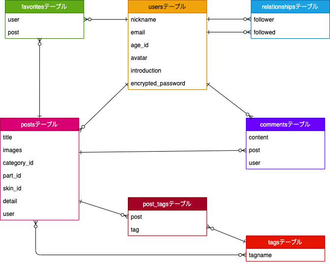
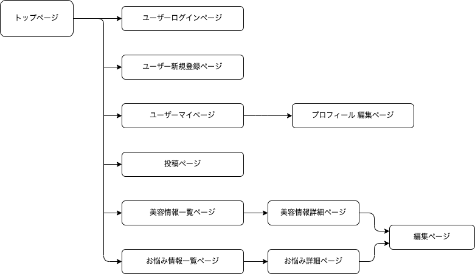

## アプリケーション名

ポリシャン(Polish and Shine)

## アプリケーション概要

美容に関する情報や悩み事をシェアする事で美容情報をインプット出来、  
または自らが抱えている美容に関する悩みをユーザー同士の意見交換により解決する事が出来る。

### トップページ

### 投稿一覧画面(美容投稿)

### 投稿一覧画面(お悩み投稿)

## URL

https://portfolio-20220717.herokuapp.com/

## テスト用アカウント

- メールアドレス : hoge@gmail.com
- パスワード    : test1234

## アプリケーションを作成した背景

SNSによる自分の姿を共有する機会が飛躍的に増えた昨今、男性の美容に対する関心や意識の高さが向上している背景が有る中で、  
美容に関する知識不足により"関心は有るが、一歩踏み出せない"といった層も一定数いるという課題を抱えている事が判明した。

この課題を引き起こす原因として、情報を取得する手段や機会が少ないのだと仮定した。

これらの課題を解決する為に、自らの持つ美容情報や悩みを共有し、ユーザー同士でコミュニケーションを取る事で、  
知識不足は改善され更に成長分野に発展させる事が出来ると考え、美容プラットフォームを開発するに至った。

## 洗い出した要件

[要件を定義したシート](https://docs.google.com/spreadsheets/d/1IWXegmBZkml6DAV7mcBG2Mi44-gABB6LbftI8qyPpSc/edit#gid=982722306)

## 機能一覧

1. ユーザー管理機能 
    - 新規登録機能(devise)
    - ログイン機能(devise)
    - マイページ表示機能
    - プロフィール編集機能(アイコン画像:carrierwave)

2. 投稿機能(FormObject)
    - 投稿機能(FormObject/画像:carrierwave)
    - 一覧表示機能
    - 詳細表示機能
    - 投稿編集機能
    - 投稿削除機能

3. いいね機能(Ajax)
    - いいね登録機能
    - いいね削除機能

4. フォロー・フォロワー機能(Ajax)
    - フォロー・フォロワー登録機能
    - フォロー・フォロワー削除機能

5. コメント機能
    - コメント登録機能
    - コメント削除機能

## 今後実装予定の機能
- Docker環境を構築する
- AWS(EC2)でのデプロイ
- 投稿タグから検索出来るように機能を追加

## データベース設計

### ER図

### 各テーブルの概要

| テーブル名        | 概要                 |
| --------------- | -------------------  |
| user            | ユーザー情報           |
| post            | 投稿情報               |
| tag             | タグ情報               |
| post_tag        | PostとTagの中間テーブル  |
| comment         | コメント情報            |
| favorite        | 投稿へのいいね情報       |
| relationship    | ユーザーのフォロー情報    |

## 画面遷移図

## 開発環境

### フロントエンド

html  
Scss  
JavaScript(jQuery)  
bootstrap  

### バックエンド

Ruby 2.6.5  
Rails 6.0.0  

### テスト

RSpec 4.0.0  
FactoryBot  

### インフラ

バージョン管理: git/github  
DB: MySQL2  
本番環境: heroku  
アプリケーションサーバー: puma  
外部ストレージ: S3  

## 工夫したポイント

- ユーザーの観点から使いやすさを重視
マイページ内にて、自らの投稿とフォロー・フォロワーの状況を確認しやすいように、
非同期通信にて実装し、タブを切り替えて簡単に確認が出来る。  
  
- ユーザー同士の交流を増やす
フォロー・フォロワー機能により、相性の良いユーザー同士でマッチングする事が出来、
ユーザー同士でお気に入りの投稿にはリアクション出来るように、コメント機能・いいね機能を実装。

- レスポンシブ対応
Web向けに実装してはいるが、モバイルでもいつでもどこでも使用出来るようにレスポンシブ対応で実装。

